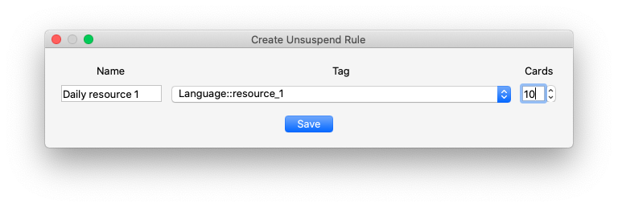
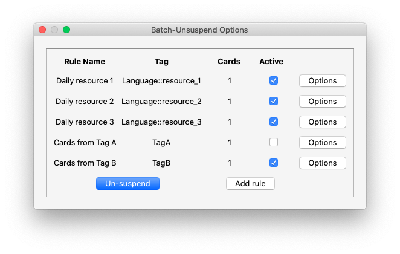

### Batch-Unsuspend

Anki add-on to un-suspend a batch of cards based on custom rules targeted at the tag level.

I have a workflow where all of my cards for a tag group are suspended. Every day I then un-suspend a number of these per tag. For example, under a main deck for a language I am learning, I have resource 1, 2 and 3, ..., each with their own tag. I would then need to go and un-suspend a different amount of cards for each of these tags to get my new cards to study for the day.

Now I can simply set up the rules for each tag once and click un-suspend in the menu each day and get right to studying.

#### Installation

Use the Anki add-on installer and search for Batch-Unsuspend

Alternatively, copy the  `batch-unsuspend`  directory to your  `addons21`  folder.

#### Screenshots

#### Use

Open the menu by going to `Tools>Batch-Unsuspend` Options in the Anki menu bar. Click 'Add rule' to create a rule for targeting which card tag will be unsuspended and how many cards to un-suspend at a time. Note, the cards are unsuspended from the tag group in the order of their creation date.

Rules can be toggled on or off using their checkbox. Rules can be deleted or edited from their respective options menu.

When 'Un-suspend' is clicked all of the the selected rules will be executed, and the cards will be unsuspended.

Currently tested and working on  `macOS Qt5.14 Anki 2.1.64` and Windows `Qt6.4.3 Anki 2.1.64`

* Please make sure to back up all of your decks before using. I have been using it personally for a while now without issue, but it is always better to be safe than sorry.